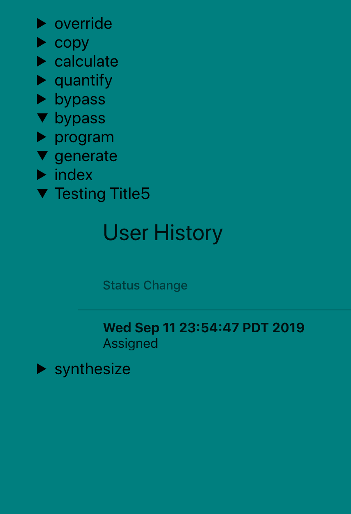

This project was bootstrapped with [Create React App](https://github.com/facebook/create-react-app).

## Lab: A Static Frontend for TaskMaster
Create a new repo taskmaster-frontend to hold your React app. Use create-react-app to generate a React app there.

## Feature Tasks
* A user should be able to visit the homepage of your React app and see the list of all tasks available in the database.
* React should be well-factored into at least 2 components.
* The homepage should have reasonable styling and layout. (Nothing too fancy, but it shouldn’t make the user cringe.)
* A user should be able to find that homepage on the Internet, deployed as a static site using S3.

## ScreenShot

## Deployed Link
[Deployed Site](http://tmaster-frontend.s3-website-us-west-2.amazonaws.com/)

## Backend Repository
[Backend](https://github.com/perezm27/TaskMaster)

## Collaborative Efforts & Works Cited
* Matt Stuhring  
* Nick Paro  
* [React Table](https://www.npmjs.com/package/react-data-table-component)